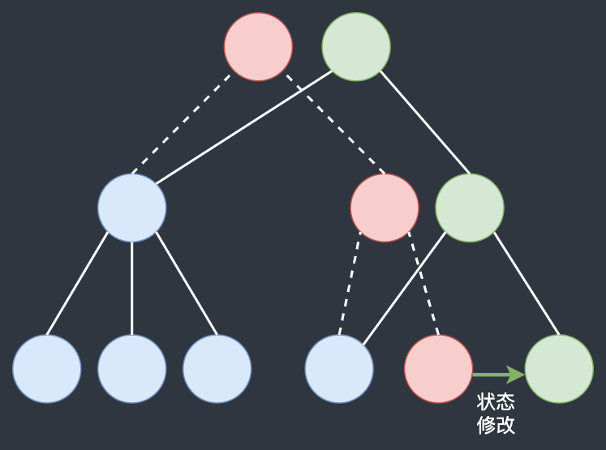
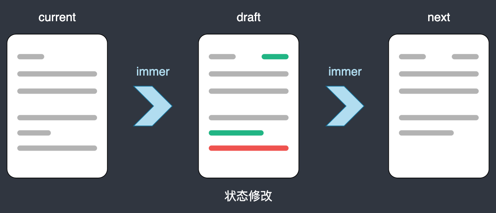
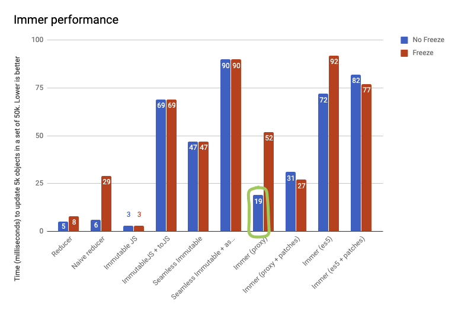

# reselect & immer 源码简读

## reselect

### selector 选择器

selector 实际上就是一个函数，它接受 redux store 中的 state（或部分 state）作为参数并返回基于 state 的数据。比如：

```JS
const selectCompanyId = state => state.companyId;
const selectTodos = state => {
  return state.todoList;
}
```

如果用过 react-redux 中的 `useSelector` hook，其实不难发现 `useSelector` 传入的第一个参数就是一个 selector。

```JS
// 传入的是一个匿名 selector
const companyId = useSelector(state => state.companyId);
```

selector 通常用于**创建派生数据**或者**进行计算量比较大的运算**，如：

```JS
// 获取已完成的 todo 数组
const selectFinishedTodos = state => state.todos.map(todo => todo.finished);

// 计算购物车中已选商品折扣之后的总价
const selectTotalFee = state => {
  const selectedGoods = state.goods.map(good => goods.selected);
  const totalFee = selectedGoods.reduce(
    (total, good) =>
      good.discount === undefined
        ? total + good.count * good.price * good.count
        : total + good.count * good.price * good.count * good.discount,
    0,
  );
  return totalFee;
}
```

但这样使用 selector 会存在性能问题：

- 在 `useSelector` 或 `mapState` 中使用的 selector 会在每次 dispatch 后重新运行，无论 state 更新的是不是 selector 中所依赖的数据项，这样就会导致很多次无意义的重复计算。
- `useSelector` 依赖 `===` 来判断 selector 的返回值引用是否相等，如果不相等则进行组件的重新渲染。这样会出现不合理的情况：selector 返回值实际上和上次是相同的，但由于返回的是一个新的引用（reference），导致组件重新渲染，比如数组的 `map()` 和 `filter()` 就是常见的典型操作。

对于 selector 出现的无意义重复调用问题，我们可以使用**记忆化**的方法来进行优化。记忆化（memoization）本质上就是缓存。它能够存储函数上一次（或者多次）调用的输入和输出，当函数再次调用时，如果输入和以前一样，就可以跳过实际的执行逻辑，直接返回上次的输出作为本次调用的结果。只在输入发生变化时执行复杂的运算逻辑重新计算，减少了大量的不必要计算，从而达到优化性能的目的。在 redux 生态系统中，reselect 就是一个可以用来创建记忆化 selector 的工具库。

### reselect 原理简析

reselect 实现记忆化的做法是通过闭包来实现的，我们来看一个闭包实现记忆化的简单例子：

```JS
const doubleNum = (params) => {
  console.log('transfrom function run');
  return params * 2;
}
const memoFunc = (func) => {
  let lastInput = null;
  let lastOutput = null;
  return innerFunc = (input) => {
    if (input === lastInput) {
      console.log('memo effect');
      return lastOutput;
    }
    lastInput = input;
    lastOutput = func(input);
    return lastOutput;
  }
}

const memoDoubleNum = memoFunc(doubleNum);
console.log(memoDoubleNum(4));
// >>> transfrom function run
// >>> 8
console.log(memoDoubleNum(4));
// >>> memo effect
// >>> 8
console.log(memoDoubleNum(5));
// >>> transfrom function run
// >>> 10
```

### reselect 源码解析

[reselect 源码](https://github.com/reduxjs/reselect/blob/master/src/index.js)只有 100+ 行，并不算复杂，首先罗列一下比较容易理解的工具函数：

默认的相等判断函数，使用引用判断的方式：

```JS
function defaultEqualityCheck(a, b) {
  return a === b
}
```

参数相等判断函数，判断前后两次的参数是否相等，有一个不等即返回 false：

```JS
function areArgumentsShallowlyEqual(equalityCheck, prev, next) {
  if (prev === null || next === null || prev.length !== next.length) {
    return false
  }

  const length = prev.length
  for (let i = 0; i < length; i++) {
    if (!equalityCheck(prev[i], next[i])) {
      return false
    }
  }

  return true
}
```

默认的记忆化函数，通过闭包实现前次参数和结果的缓存：

```JS
export function defaultMemoize(func, equalityCheck = defaultEqualityCheck) {
  let lastArgs = null
  let lastResult = null
  return function () {
    if (!areArgumentsShallowlyEqual(equalityCheck, lastArgs, arguments)) {
      lastResult = func.apply(null, arguments)
    }

    lastArgs = arguments
    return lastResult
  }
}
```

获取依赖项函数，判断传入的每个 _input selector_ 是否是函数，返回结果是一个 _input selector_ 数组：

```JS
function getDependencies(funcs) {
  // 这里的 funcs 参数即 input selector 组成的数组
  // input selector 有两种传参方式（数组、多个单独参数）
  // 所以 funcs 的结构会有两种：[[iSelector1, iSelector2]]、[iSelector1, iSelector2]
  // 因此需要通过这里的判断获取正确的依赖数组
  const dependencies = Array.isArray(funcs[0]) ? funcs[0] : funcs

  if (!dependencies.every(dep => typeof dep === 'function')) {
    const dependencyTypes = dependencies.map(
      dep => typeof dep
    ).join(', ')
    throw new Error(
      'Selector creators expect all input-selectors to be functions, ' +
      `instead received the following types: [${dependencyTypes}]`
    )
  }

  return dependencies
}
```

接下来分析两个重要的 API：`createSelector` 和 `createStructuredSelector`。

首先来看项目中最为常用的 `createSelector` 函数。`createSelector` 接受一个或多个 _input selector_ 和一个 _output selector_ 作为参数，并返回一个新的 selector 给我们使用。

```JS
export const createSelector = /* #__PURE__ */ createSelectorCreator(defaultMemoize)
```

而在源码中，`createSelector` 实际上是由 `createSelectorCreator` 的函数生成的，这个函数会返回一个 `createSelector`，并且允许我们传入参数来实现定制的 `createSelector`。

```JS
// memoize —— 记忆化函数
// memoizeOptions —— 记忆化函数中调用的相等比较方法，如这里传入 lodash 的 isEqual 函数
export function createSelectorCreator(memoize, ...memoizeOptions) {
  // 这里返回的函数就是 createSelector
  // 参数 funcs 就是 input selector 和 output selector 组成的数组
  return (...funcs) => {
    let recomputations = 0
    // 获取 output selector
    const resultFunc = funcs.pop()
    // 判断并获取依赖项数组
    const dependencies = getDependencies(funcs)
    // 封装记忆化的结果计算函数
    const memoizedResultFunc = memoize(
      function () {
        recomputations++
        // 结果计算函数
        return resultFunc.apply(null, arguments)
      },
      ...memoizeOptions
    )
    // selector 同样也是一个记忆化函数，是 createSelector 的返回值
    const selector = memoize(function () {
      const params = []
      const length = dependencies.length
      // 获取所有 input selector 的执行结果
      for (let i = 0; i < length; i++) {
        params.push(dependencies[i].apply(null, arguments))
      }
      // params 传入记忆化的结果计算函数进行计算
      return memoizedResultFunc.apply(null, params)
    })
    // 将几个属性赋给 selector
    selector.resultFunc = resultFunc
    selector.dependencies = dependencies
    selector.recomputations = () => recomputations
    selector.resetRecomputations = () => recomputations = 0
    return selector
  }
}
```

`createSelectorCreator` 中使用了两个记忆化函数，`memoizedResultFunc` 的依赖项是各个 _input selector_ 的执行结果组成的数组。而 `selector` 的依赖项则是我们传入的 state，如果 state 相同，`selector` 内部就不会调用 _input selector_ 获取结果，而是直接返回缓存的结果。

最后是 `createStructuredSelector` 这个 API，它的作用是接受一个属性为 _input selector_ 的对象并返回一个 selector。selector 会返回一个对象，其中 key 与输入参数相同，但 value 是选择器的值。

```JS
export const createSelector = createSelectorCreator(defaultMemoize)

export function createStructuredSelector(selectors, selectorCreator = createSelector) {
  if (typeof selectors !== 'object') {
    throw new Error(
      'createStructuredSelector expects first argument to be an object ' +
      `where each property is a selector, instead received a ${typeof selectors}`
    )
  }
  const objectKeys = Object.keys(selectors)

  return selectorCreator(
    // input selectors
    objectKeys.map(key => selectors[key]),
    // outpot selector
    // 这个函数会将 input selectors 的执行结果组合成一个对象
    (...values) => {
      return values.reduce((composition, value, index) => {
        composition[objectKeys[index]] = value
        return composition
      }, {})
    }
  )
}
```

## immer

### Why immutable

redux 的最佳实践中有这样一句话：_Do Not Mutate State_[^1]。Why？[redux-toolkit 官网](https://redux-toolkit.js.org/usage/immer-reducers#immutability-and-redux)中给出了几条理由：

- 造成 bug，例如 UI 未正确更新显示最新值。
  > react-redux 中的 `connect` 和 `useSelector` 进行状态变化检测时，采用的是 `===` 引用比较（react 的 `shouldComponentUpdate` 也默认采用这种方式），而引用比较必须依赖于 immutable（不变性）才可以正常工作。
- 难以理解为什么更新状态以及更新状态的方式。
- 使得编写测试变得更加困难。
- 无法正确使用“时间旅行调试”。
- 违背了 redux 的设计模式和使用模式。

所以我们在 reducer 中处理 state 变化时，要进行 state 的拷贝，然后修改副本再返回新的 state（这里就是为了保证 state 的 immutable）。但这样也带来了问题：

- state 嵌套层级过深，每一层都要用 `...` 扩展符进行浅拷贝，难免会出现错误，不利于开发人员编码。
- 如果直接深拷贝，会增加 CPU 和内存的非必要负担。

针对简单拷贝实现 immutable state 带来的问题，Facebook 开源的 immutable.js 使用了基于 hash maps tries[^2] 和 vector tries[^3] 的 structural sharing（结构共享）[^4]来解决。简单描述就是：当树中的一个节点发生变化时，只修改这个节点和受它影响的上层节点，其他节点直接共享。可以参考下图理解：



immutable.js 是一个兼顾**数据 immutable** 和**运行性能**的优秀工具，但其使用了不同于 JavaScript Object、Array 等数据结构的 mutative API，容易导致项目中使用错乱。为了尽可能的减少 immutable.js 的 mutative API 对项目的干扰，我们一般会使用 `fromJS()` 和 `toJS()` 进行必要的数据结构转换。

而 immer 这个库的出现，则以更小的代价，赋予了 JavaScript 数据的 immutable 特性。相比于 immutable.js，immer 支持使用 JavaScript 的原生 API 对 Object、Array 等数据结构进行修改，更加便利。如果项目中有用到 redux toolkit 这个库的话，我们可以直接在 reducer 中编写 mutative 式的代码逻辑（RTK 的 `createReducer` 内置了 immer，帮助我们保证 state 的 immutable），这大大提高了 reducer 的可读性和编码的简洁性。

### immer 原理简析

immer 的基本思想是：当你通过 mutative 式的代码进行状态更改时，这些更改并不是直接在 currentState 上进行的，而是作用于一个 draft，draft 是 currentState 的**代理**。当你完成了所有的变更，Immer 将根据 draft 的变更生成 nextState。如下图所示：



这个思想和我们的拷贝其实是相似的，但是 immer 采用了 **copy on write** 的策略进行优化。

> copy-on-write（写时复制，简称 COW）是一种计算机程序设计领域的优化策略。其核心思想是：如果有多个调用者（callers）同时要求相同资源（如内存或磁盘上的数据存储），他们会共同获取相同的指针指向相同的资源，直到某个调用者试图修改资源的内容时，系统才会真正复制一份专用副本（private copy）给该调用者，而其他调用者所见到的最初的资源仍然保持不变。这过程对其他的调用者都是透明的。此作法主要的优点是如果调用者没有修改该资源，就不会有副本被创建，因此多个调用者只是读取操作时可以共享同一份资源。

与每次先拷贝 state 然后再修改副本的做法相比，immer 采用 COW 的策略减少了很多修改 state 时的非必要复制，生成 nextState 时又可以利用结构共享来进行状态的组装，所以有着不错的性能表现。

### Proxy 术语介绍

ES6 提供的 Proxy 对象可以实现对指定对象读取/写入等操作的监听和拦截，immer 就是利用这一特性实现的 COW，而 ES6 之前并没有提供这一特性，所以需要通过 `defineProperty` 来实现（好熟悉的配方～）。不过 ES5 的实现性能上要差上不少。

这里简单说一下 Proxy 中使用三个专用术语和一个方法，对我们接下来分析 immer 源码会有帮助：

- `target`：被代理的原始对象。
- `trap`：具体的属性访问方法，是一个函数，可以理解为捕获器。
- `handler`：一个带有捕获器函数的处理器对象。
- `Proxy.revocable()`：创建一个可以撤销的 Proxy 对象。

如：

```JS
const handler = {
  // get 捕获器
  get(target, prop) {
    ...
  },
  // set 捕获器
  set(target, prop, value) {
    ...
  }
}
const p = new Proxy(target, handler);

// proxy 即生成的代理对象
// 如果我们想撤销代理，在合适的时机执行 revoke() 即可
const { proxy, revoke } = Proxy.revocable(target, handler);
```

### immer 源码简析

immer 中的核心 API 是 `produce`，它的基本用法如下：

```JS
// 常规用法
produce(currentState, recipe: (draftState) => void | draftState, ?PatchListener): nextState

// curry 化用法
produce(recipe: (draftState) => void | draftState, ?PatchListener)(currentState): nextState

// 使用示例
import produce from "immer";

const baseState = [
  {
    todo: 'coding',
    done: true,
  },
  {
    todo: 'bugfix',
    done: false,
  },
];

const nextState = produce(baseState, draftState => {
  draftState.push({ todo: 'rest' });
  draftState[1].done = true;
});
```

`produce` 的源码如下：

```JS {7,11,23,33}
// base 即 state，recipe 是对于 draft 进行修改的具体函数
produce: IProduce = (base: any, recipe?: any, patchListener?: any) => {
  let result
  if (isDraftable(base)) {
    const scope = enterScope(this)
    // 创建代理对象
    const proxy = createProxy(this, base, undefined)
    let hasError = true
    try {
      // 修改 draftState
      result = recipe(proxy)
      hasError = false
    } finally {
      // finally instead of catch + rethrow better preserves original stack
      if (hasError) revokeScope(scope)
      else leaveScope(scope)
    }
    if (typeof Promise !== "undefined" && result instanceof Promise) {
      return result.then(
        result => {
          usePatchesInScope(scope, patchListener)
          // 处理结果并返回
          return processResult(result, scope)
        },
        error => {
          revokeScope(scope)
          throw error
        }
      )
    }
    usePatchesInScope(scope, patchListener)
    // 处理结果并返回
    return processResult(result, scope)
  } else if (!base || typeof base !== "object") {
    result = recipe(base)
    if (result === NOTHING) return undefined
    if (result === undefined) result = base
    if (this.autoFreeze_) freeze(result, true)
    return result
  } else die(21, base)
}

```

简单来讲， `produce` 中完成 `currentState => nextState` 需要三个步骤：

1. 创建对应的代理对象：`const proxy = createProxy(this, base, undefined)`。
2. 执行定义的 `recipe` 函数对 draft 进行修改：`result = recipe(proxy)`。
3. 处理结果并返回 nextState：`return processResult(result, scope)`（这里分了异步和同步）。

接下来我们再对这三步进行详细分析。

首先来看创建代理对象，`createProxy` 内部调用的关键函数是 `createProxyProxy`，该函数生成了 state 对应的 draftState。

```JS
export function createProxyProxy<T extends Objectish>(
  base: T,
  parent?: ImmerState
): Drafted<T, ProxyState> {
  const isArray = Array.isArray(base)
  const state: ProxyState = {
    type_: isArray ? ProxyType.ProxyArray : (ProxyType.ProxyObject as any),
    // 用于记录生成的所有 draft 和其他信息的一个对象
    scope_: parent ? parent.scope_ : getCurrentScope()!,
    // 是否改动的标记
    modified_: false,
    // 是否已经完成（是否定稿）
    finalized_: false,
    // 具体属性的修改标记
    assigned_: {},
    // 父 draftState
    parent_: parent,
    // state
    base_: base,
    // state 的代理对象 draftState
    draft_: null as any,
    // state 的拷贝
    copy_: null,
    // 撤销代理
    revoke_: null as any,
    isManual_: false
  }

  let target: T = state as any
  let traps: ProxyHandler<object | Array<any>> = objectTraps
  if (isArray) {
    target = [state] as any
    traps = arrayTraps
  }

  const {revoke, proxy} = Proxy.revocable(target, traps)
  state.draft_ = proxy as any
  state.revoke_ = revoke
  return proxy as any
}
```

`createProxyProxy` 首先对我们的 state 进行了扩展，变成了一个 proxyState，然后依据这个 proxyState 生成了一个代理对象 draftState 并返回供我们使用。

第二步 `recipe` 执行的过程中，immer 如何捕获并处理读写操作是这一步的关键，因此我们重点需要关注代理对象中 `getter` 和 `setter` 的逻辑。

`getter` 捕获器

```JS
// getter trap
get(state, prop) {
  if (prop === DRAFT_STATE) return state
  // 获取最新的 state
  const source = latest(state)
  // 原型链上查找对应的属性
  if (!has(source, prop)) {
    return readPropFromProto(state, source, prop)
  }
  const value = source[prop]
  // 如果已经定稿或者 value 已经是原始类型则直接返回
  if (state.finalized_ || !isDraftable(value)) {
    return value
  }
  // 如果 value === state[prop]，即之前还没有访问过
  if (value === peek(state.base_, prop)) {
    // 浅拷贝：state.base_ => state.copy_
    prepareCopy(state)
    // 创建 value 对应的代理对象并返回
    return (state.copy_![prop as any] = createProxy(
      state.scope_.immer_,
      value,
      state
    ))
  }
  // 之前已经访问过，即已经创建了对应的代理对象，则直接返回对应的 value
  return value
}

// setter trap
set(
  state: ProxyObjectState,
  prop: string /* strictly not, but helps TS */,
  value
) {
  const desc = getDescriptorFromProto(latest(state), prop)
  if (desc?.set) {
    // 特殊情况：如果此写入被 setter 捕获，必须使用正确的上下文触发它
    desc.set.call(state.draft_, value)
    return true
  }
  // 如果 modified_ 属性为 false，即是第一次修改
  if (!state.modified_) {
    // 特殊情况处理
    const current = peek(latest(state), prop)
    const currentState: ProxyObjectState = current?.[DRAFT_STATE]
    if (currentState && currentState.base_ === value) {
      state.copy_![prop] = value
      state.assigned_[prop] = false
      return true
    }
    if (is(value, current) && (value !== undefined || has(state.base_, prop)))
      return true
    // 确认是否拷贝 base_，如果没有则浅拷贝
    prepareCopy(state)
    // 递归翻转 modified_ 的状态为 true
    markChanged(state)
  }

  if (
    state.copy_![prop] === value &&
    // 特殊情况：NaN
    typeof value !== "number" &&
    // 特殊情况：value 为 undifined
    (value !== undefined || prop in state.copy_)
  )
    return true

  // 在 copy_ 上执行修改
  state.copy_![prop] = value
  state.assigned_[prop] = true
  return true
}

export function markChanged(state: ImmerState) {
  if (!state.modified_) {
    state.modified_ = true
    if (state.parent_) {
      markChanged(state.parent_)
    }
  }
}
```

最后一步则是生成 nextState 的过程，`processResult` 中关键的步骤是 `finalize` 函数，我们直接来看这个函数的具体逻辑。

```JS {15-18,20-34,45,66-67,76}
function finalize(rootScope: ImmerScope, value: any, path?: PatchPath) {
  if (isFrozen(value)) return value
  const state: ImmerState = value[DRAFT_STATE]
  if (!state) {
    each(
      value,
      (key, childValue) =>
        finalizeProperty(rootScope, state, value, key, childValue, path),
      true
    )
    return value
  }
  if (state.scope_ !== rootScope) return value
  // 未修改过，则直接冻结并返回 base_
  if (!state.modified_) {
    maybeFreeze(rootScope, state.base_, true)
    return state.base_
  }
  // 修改过，则遍历 copy_ 中的每个 prop
  if (!state.finalized_) {
    state.finalized_ = true
    state.scope_.unfinalizedDrafts_--
    const result =
      state.type_ === ProxyType.ES5Object || state.type_ === ProxyType.ES5Array
        ? (state.copy_ = shallowCopy(state.draft_))
        : state.copy_
    // 遍历
    each(
      state.type_ === ProxyType.Set ? new Set(result) : result,
      (key, childValue) =>
        finalizeProperty(rootScope, state, result, key, childValue, path)
    )
    // finalize 完毕，冻结 copy_
    maybeFreeze(rootScope, result, false)
    if (path && rootScope.patches_) {
      getPlugin("Patches").generatePatches_(
        state,
        path,
        rootScope.patches_,
        rootScope.inversePatches_!
      )
    }
  }
  // 返回 copy_ 作为 nextState
  return state.copy_
}

function finalizeProperty(
  rootScope: ImmerScope,
  parentState: undefined | ImmerState,
  targetObject: any,
  prop: string | number,
  childValue: any,
  rootPath?: PatchPath
) {
  if (__DEV__ && childValue === targetObject) die(5)
  if (isDraft(childValue)) {
    const path =
      rootPath &&
      parentState &&
      parentState!.type_ !== ProxyType.Set &&
      !has((parentState as Exclude<ImmerState, SetState>).assigned_!, prop)
        ? rootPath!.concat(prop)
        : undefined
    // 调用 finalize 并将结果赋给 targetObject 对应的 prop
    const res = finalize(rootScope, childValue, path)
    set(targetObject, prop, res)
    if (isDraft(res)) {
      rootScope.canAutoFreeze_ = false
    } else return
  }
  if (isDraftable(childValue) && !isFrozen(childValue)) {
    if (!rootScope.immer_.autoFreeze_ && rootScope.unfinalizedDrafts_ < 1) {
      return
    }
    finalize(rootScope, childValue)
    if (!parentState || !parentState.scope_.parent_)
      maybeFreeze(rootScope, childValue)
  }
}
```

### immer 性能表现

[immer 官网](https://immerjs.github.io/immer/performance)给出了一个基本的性能测试。测试内容是共有 50k 个 todos，一次更新其中的 5k 个，分为 freeze 与 no freeze。

> 开发环境中使用 freeze 是 immer 推荐的做法，可以防止开发者意外改变状态树。生产环境可以关闭来提高性能。



从图中看，大致可以得出以下几个结论：

- 使用 Proxy 的 immer 大概比我们手写 reducer 慢 2 ～ 3 倍，但还是比较快的。考虑到 immer 在开发中带来的效率提升，这点性能损失可以接受。
- immer 没有 immutableJS 快。然而，项目中如果使用 immutableJS + toJS，性能表现则要比 immer 差不少。
- immer 的 ES5 实现性能比 Proxy 要差 2 倍甚至更多，这也是 immer 的一个小缺点。

[^1]: [redux 最佳实践](https://redux.js.org/style-guide/style-guide#do-not-mutate-state)
[^2]: [wiki——hash maps tries](https://en.wikipedia.org/wiki/Hash_array_mapped_trie)
[^3]: [Understanding Clojure's Persistent Vectors](https://hypirion.com/musings/understanding-persistent-vector-pt-1)
[^4]: [精读 Immutable 结构共享](https://zhuanlan.zhihu.com/p/27133830?group_id=851585269567213568)

测试一下 :100:

::: info
This is an info.
:::

::: tip
This is a tip.
:::

::: warning
This is a warning.
:::

::: danger
This is a dangerous warning.
:::
::: details
This is a details block.
:::
